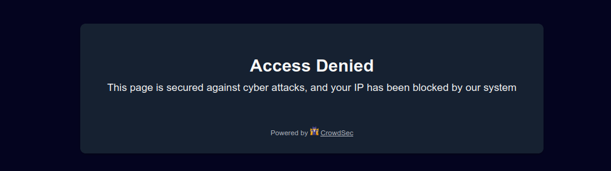

# CrowdSec Node.js bouncer

## User Guide

**Table of Contents**

<!-- START doctoc generated TOC please keep comment here to allow auto update -->
<!-- DON'T EDIT THIS SECTION, INSTEAD RE-RUN doctoc TO UPDATE -->

- [Prerequisites](#prerequisites)
- [Features](#features)
- [Usage](#usage)
- [Configurations](#configurations)
    - [Bouncer behavior](#bouncer-behavior)
    - [Local API Connection](#local-api-connection)
    - [Cache](#cache)
    - [Captcha and Ban walls settings](#captcha-and-ban-walls-settings)
- [Implement your own bouncer](#implement-your-own-bouncer)
    - [Instantiation](#instantiation)
    - [Apply a remediation](#apply-a-remediation)
    - [Refresh decision cache](#refresh-decision-cache)
    - [Custom Captcha](#custom-captcha)
    - [Custom Cache Adapter](#custom-cache-adapter)
- [Examples](#examples)
    - [Basics](#basics)
    - [Express server](#express-server)

<!-- END doctoc generated TOC please keep comment here to allow auto update -->

## Prerequisites

To be able to use a bouncer based on this package, the first step is to
install [CrowdSec v1](https://doc.crowdsec.net/docs/getting_started/install_crowdsec/). CrowdSec is only in charge of
the "detection", and won't block anything on its own. You need to deploy a bouncer to "apply" decisions.

Please note that first and foremost a CrowdSec agent must be installed on a server that is accessible by this library.

## Features

- CrowdSec Local API support

    - Handle `ip` and `range` scoped decisions
    - `Live mode` or `Stream mode`

- Support IpV4 and Ipv6 (Ipv6 range decisions are yet only supported in `Live mode`)

## Usage

When a user is suspected by CrowdSec to be malevolent, the bouncer would either display a captcha to resolve or
simply a page notifying that access is denied. If the user is considered as a clean user, the page will be accessible
as normal.

A ban wall could look like:



A captcha wall could look like:


With the provided bouncer, it is possible to customize all the colors of these pages so that they integrate
best with your design.

On the other hand, all texts are also fully customizable. This will allow you, for example, to present translated pages
in your users' language.

## Configurations

The first parameter of the `CrowdSecBouncer` class constructor method is an object of settings.

Below is the list of available settings (see also `CrowdSecBouncerConfigurations` type in `src/lib/bouncer/types.ts`):

### Bouncer behavior

- `bouncingLevel`: Select from `disabled_bouncing`, `normal_bouncing` or `flex_bouncing`.
  Choose if you want to apply CrowdSec directives (Normal bouncing) or be more permissive (Flex mode).
  With the `Flex mode`, it is impossible to accidentally block access to your site to people who don’t deserve it.
  This mode makes it possible to never ban an IP but only to offer a captcha, in the worst-case scenario.


- `fallbackRemediation`: Select from `bypass` (minimum remediation), `captcha` or `ban` (maximum remediation).
  Default to 'captcha'. Handle unknown remediation as.


- `streamMode`: true to enable stream mode, false to enable the live mode.
  Default to false.

  By default, the `live mode` is enabled. The first time a visitor connects to your website, this mode means that the IP
  will be
  checked directly by the CrowdSec API. The rest of your user’s browsing will be even more transparent thanks to the
  cache system.
  But you can also activate the `stream mode`. This mode allows you to constantly feed
  the bouncer with the malicious IP list via a background task (CRON), making it to be even faster when checking the IP
  of your visitors. Besides, if your site has a lot of unique visitors at the same time, this will not influence the
  traffic to the API of your CrowdSec instance.

### Local API Connection

- `bouncerApiToken`: Key generated by the cscli (CrowdSec cli) command like `cscli bouncers add node-bouncer`.


- `url`: Define the URL to your Local API server (Example: `http://localhost:8080`).


- `userAgent`: Define the User-Agent to use when calling the Local API. Default to `nodejs-cs-bouncer/v<x.y.z>'`.

### Cache

- `cacheAdapter`: Define the cache adapter to use. Default to `InMemory`.
  Cache system aims to reduce the number of calls to the CrowdSec API. The main purpose is to store the decisions.
  It's also used to store the captcha flow data for a given IP and other data corresponding to the bouncer's state.


- `cleanIpCacheDuration`: Set the duration we keep in cache the fact that an IP is clean. In seconds. Defaults to 60.


- `badIpCacheDuration`: Set the duration we keep in cache the fact that an IP is bad (for `captcha` and `ban`
  remediation). In seconds. Defaults to 120.

  In Live Mode, the lifetime of the cached decision will be the minimum between this setting and the decision duration.

  In Stream Mode, the cache duration depends only on the decision duration.


- `captchaFlowCacheDuration`: Set the duration we keep in cache the captcha flow variables for an IP. In seconds.
  Defaults to 86400. This means that once a captcha is solved, it won’t need to be solved again for 24 hours.

### Captcha and Ban walls settings

- `wallOptions`: Define the options for the wall rendering. Default to:

```json lines
{
  "ban": {
    "texts": {
      "tabTitle": "CrowdSec | Ban Wall",
      "title": "Access Denied",
      "subtitle": "This page is secured against cyber attacks, and your IP has been blocked by our system",
      "footer": ""
    },
    "content": "HTML generated with /src/lib/rendered/templates/base.ejs+ban.ejs",
    "colors": {
      "text": {
        "primary": "#F9FAFA",
        "secondary": "#B0B5BF",
        "button": "#F9FAFA",
        "error_message": "#F55B60"
      },
      "background": {
        "page": "#04041F",
        "container": "#162131",
        "button": "#888BCE"
      }
    },
    "hideCrowdSecMentions": false,
    "style": ""
  },
  "captcha": {
    "captchaImageTag": "Generated with svg-captcha-fixed",
    "texts": {
      "tabTitle": "CrowdSec | Captcha Wall",
      "title": "Access Denied",
      "subtitle": "Please complete the security check.",
      "refresh_image_link": "Reload the image",
      "captcha_placeholder": "Type here...",
      "send_button": "Continue",
      "error": "",
      "footer": ""
    },
    "content": "HTML generated with /src/lib/rendered/templates/base.ejs+captcha.ejs",
    "colors": {
      "text": {
        "primary": "#F9FAFA",
        "secondary": "#B0B5BF",
        "button": "#F9FAFA",
        "error_message": "#F55B60"
      },
      "background": {
        "page": "#04041F",
        "container": "#162131",
        "button": "#888BCE"
      }
    },
    "hideCrowdSecMentions": false,
    "style": "CSS generated with /src/lib/rendered/templates/captcha-css.ejs"
  }
}
```

## Implement your own bouncer

### Instantiation

Invoking the bouncer is as simple as:

```typescript
import { CrowdSecBouncer, CrowdSecBouncerConfigurations } from '@crowdsec/nodejs-cs-bouncer';

const config: CrowdSecBouncerConfigurations = {
    url: 'http://localhost:8080',
    bouncerApiToken: 'your-api-key',
};

// Init the bouncer
const bouncer = new CrowdSecBouncer(config);

// Get the remediation (value and origin) for an IP
const remediationData = await bouncer.getIpRemediation(malevolentIp);

console.log(remediationData);
// output: { remediation: 'ban', origin: 'cscli' }
```

### Apply a remediation

Thanks to the bouncer, you know the remediation about a given IP.
To apply the remediation you can use render methods offered by the library. You can either display a ban wall or a
captcha wall.

```typescript
const { origin, remediation } = remediationData;
const bouncerResponse = await bouncer.getResponse({
    ip,
    origin,
    remediation,
});
// Display Ban or Captcha wall
if (bouncerResponse.status !== 200) {
    return res.status(bouncerResponse.status).send(bouncerResponse.html);
}
```

### Refresh decision cache

When you are using the stream mode, there will be no call to the CrowdSec API for the decisions. Instead, the bouncer
will only use the cache to get the decisions. That's why you need to refresh the cache regularly.

```typescript
// Refresh the decision cache
await bouncer.refreshDecisions({
    origins: ['cscli', 'CAPI'], // CAPI, lists, cscli, etc
    scopes: ['ip', 'range'],
});
```

In live mode, it could also be useful to refresh the cache to get the latest decisions.
Indeed, bouncer will first check the cached decisions for the current IP before calling the CrowdSec API.

### Custom Captcha

By default, this bouncer generates captcha using [
`svg-captcha-fixed` package](https://www.npmjs.com/package/svg-captcha-fixed).

If you want to use your own captcha generator, you can pass a custom captcha to the bouncer.

This captcha must implement the `CaptchaGenerator` interface (see `src/lib/bouncer/captcha.ts`):

```typescript
import { CrowdSecBouncer, CrowdSecBouncerConfiguration, CaptchaGenerator } from '@crowdsec/nodejs-cs-bouncer';

const config: CrowdSecBouncerConfiguration = {
    url: 'http://localhost:8080',
    bouncerApiToken: 'your-api-key',
};

const customCaptchaGenerator: CaptchaGenerator = {
    create: () => {
        // Your custom captcha generation logic
        const captcha = generateCustomCaptcha();
        return {
            phraseToGuess: captcha.phraseToGuess,
            inlineImage: captcha.inlineImage,
        };
    },
};

// Pass the custom captcha generator to the bouncer as a second argument
const bouncer = new CrowdSecBouncer(config, customCaptchaGenerator);
```

### Custom Cache Adapter

By default, this bouncer uses an "in-memory" cache.

You can pass your own custom cache adapter to the bouncer, for example to use Redis or any other cache system.

Cache adapter must implement the `CacheAdapter` interface (see `src/lib/cache/interfaces.ts`) and be passed as
the `cacheAdapter` configuration option.

Please refer also to `src/lib/cache/key-adapter.ts` for an example of implementation
using [Keyv](https://keyv.org/docs/).

```typescript
import { CrowdSecBouncer, CrowdSecBouncerConfiguration, CacheAdapter } from '@crowdsec/nodejs-cs-bouncer';

const customCacheAdapter: CacheAdapter = {
    getItem: (key: string) => {
        // Your custom cache get logic
        return getFromCustomCache(key);
    },
    setItem: (key: string, value: any) => {
        // Your custom cache set logic
        return setToCustomCache(key, value);
    },
    deleteItem: (key: string) => {
        // Your custom cache delete logic
        return deleteFromCustomCache(key);
    },
    clear: () => {
        // Your custom cache clear logic
        return clearCustomCache();
    },
};

const config: CrowdSecBouncerConfiguration = {
    url: 'http://localhost:8080',
    bouncerApiToken: 'your-api-key',
    cacheAdapter: customCacheAdapter,
};

// Init the bouncer
const bouncer = new CrowdSecBouncer(config);
```

## Examples

### Basics

The [`examples/basics`](../examples/basics) directory contains a simple scripts that demonstrates the basic usage of the
bouncer:

- getting a remediation for an IP
- refreshing the decision cache

### Express server

You can find an example of an Express server using this bouncer in the [
`examples/express-server`](../examples/express-server) directory.

This example demonstrates how to use the bouncer to protect your Express server from malevolent IPs.
