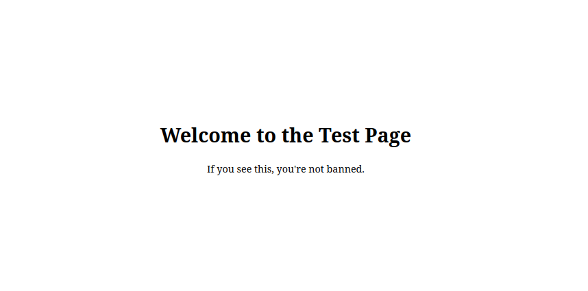
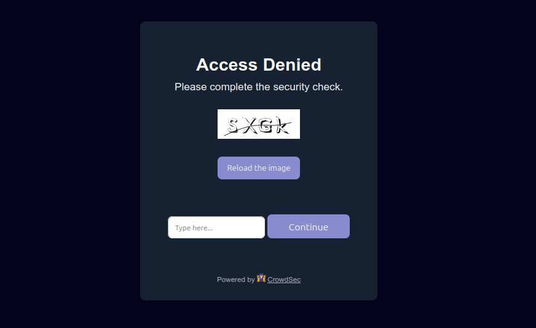

# Express server basic implementation

The `express-server` folder contains a basic implementation of the CrowdSec NodeJs
remediation component.

It aims to help developers to understand how to integrate CrowdSec remediation in their NodeJs application.

**Table of Contents**

<!-- START doctoc generated TOC please keep comment here to allow auto update -->
<!-- DON'T EDIT THIS SECTION, INSTEAD RE-RUN doctoc TO UPDATE -->

- [Technical overview](#technical-overview)
- [Test the bouncer](#test-the-bouncer)
  - [Pre-requisites](#pre-requisites)
  - [Prepare the tests](#prepare-the-tests)
  - [Test a "bypass" remediation](#test-a-bypass-remediation)
  - [Test a "ban" remediation](#test-a-ban-remediation)
  - [Test a "captcha" remediation](#test-a-captcha-remediation)

<!-- END doctoc generated TOC please keep comment here to allow auto update -->

## Technical overview

All the logic is done in the `server.ts` file:

- we use a middleware to act before rendering the page

- We retrieve the remediation for the current tested IP:

```js
const remediationData = await bouncer.getIpRemediation(ip);
const { origin, remediation } = remediationData;
```

- Depending on the value of the remediation, we apply it:

    - let the process continue with `next()`if there is no remediation (bypass)

    - block the user with a ban or captcha wall remediation:

  ```js
  const bouncerResponse = await bouncer.getResponse({
      ip,
      origin,
      remediation,
  });
  // Display Ban or Captcha wall
  if (bouncerResponse.status !== 200) {
      return res.status(bouncerResponse.status).send(bouncerResponse.html);
  }
  ```

There is a specific case when we detect that user is trying to solve the captcha:

```js
if (req.method === 'POST' && req?.body?.crowdsec_captcha_submit) {
    const { phrase, crowdsec_captcha_refresh: refresh } = req.body;
    // User can refresh captcha image or submit a phrase to solve the captcha
    await bouncer.handleCaptchaSubmission({
        ip,
        origin,
        userPhrase: phrase ?? '',
        refresh: refresh ?? '0',
    });
    return res.redirect(captchaSuccessUrl);
}
```

## Test the bouncer

### Pre-requisites

- Node.js and Docker installed on your machine

    - You can run `nvm use` from the root folder to use the recommended NodeJS version for this project

- Copy the `.env.example` file to `.env` and fill in the required values

- Copy the `crowdsec/.env.example` file to `crowdsec/.env` and fill in the required values

- Install bouncer dependencies and test dependencies (run the following commands from the `express-server` folder):

  ```shell
  npm --prefix ../.. install && npm install
  ```

- Build the project sources

  ```shell
  npm --prefix ../.. run build
  ```

### Prepare the tests

1. Launch the docker instance:

```shell
docker compose up
```

This will instantiate a CrowdSec container with a `http://localhost:8080` LAPI url.

2. Create a bouncer

In another terminal, create a bouncer if you haven't already:

```shell
docker exec -ti nodejs-cs-crowdsec sh -c 'cscli bouncers add NodeBouncer --key $BOUNCER_KEY'
```

We are using here the `BOUNCER_KEY` variable defined in `crowdsec/.env` file.

3. Launch the Express Server

```shell
npm run start
```

For development, you can use:

```shell
npm run dev
```

This will launch an Express server accessible on `http://localhost:3000` (aka "the home page") with
`tests/express-server/server.ts` file as entry point.

You should see different log messages in your terminal when you access the home page.

### Test a "bypass" remediation

As you don't have yet any decisions, you can access the `http://localhost:3000` page and just see the normal content "
Welcome to the Test Page".



You should see `Final remediation for IP <BOUNCED_IP> is bypass` in the terminal.

### Test a "ban" remediation

First, add a ban remediation for the IP that will be tested:

```shell
docker exec -ti nodejs-cs-crowdsec sh -c 'cscli decisions add --ip $BOUNCED_IP --duration 12m --type ban'
```

We are using here the `BOUNCED_IP` variable defined in `crowdsec/.env` file.

You should see the success message `Decision successfully added`.

If you try to access the home page (after one minute as it is the default ttl for clean IP), you should the "Access
Denied" ban wall.


You should see `Final remediation for IP <BOUNCED_IP> is ban` in terminal.

### Test a "captcha" remediation

First, remove your last decision:

```shell
docker exec -ti nodejs-cs-crowdsec sh -c 'cscli decisions delete --ip $BOUNCED_IP'
```

Then, add a captcha decision:

```shell
docker exec -ti nodejs-cs-crowdsec sh -c 'cscli decisions add --ip $BOUNCED_IP --duration 12m --type captcha'
```

If you try to access the home page (after two minutes as it is the default ttl for malicious IP), you should the "Access
Denied" captcha wall.



You should see `Final remediation for IP <BOUNCED_IP> is captcha` in terminal.

For this basic implementation, we just redirect user to `/` after resolution.
