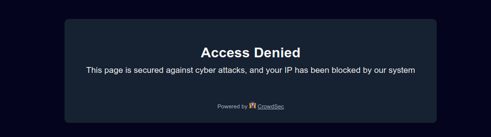

# NextJS basic implementation

The `nextjs` folder contains a basic implementation of the CrowdSec NodeJs
remediation component for Next.js applications.

It aims to help developers to understand how to integrate CrowdSec remediation in their Next.js application.

**Table of Contents**

<!-- START doctoc generated TOC please keep comment here to allow auto update -->
<!-- DON'T EDIT THIS SECTION, INSTEAD RE-RUN doctoc TO UPDATE -->

- [NextJS basic implementation](#nextjs-basic-implementation)
    - [Technical overview](#technical-overview)
        - [Middleware (`src/middleware.ts`)](#middleware-srcmiddlewarets)
        - [API Routes](#api-routes)
            - [Remediation Check (
              `src/app/api/crowdsec/remediation/route.ts`)](#remediation-check-srcappapicrowdsecremediationroutets)
            - [Captcha Handler (
              `src/app/api/crowdsec/captcha/route.ts`)](#captcha-handler-srcappapicrowdseccaptcharoutets)
    - [Test the bouncer](#test-the-bouncer)
        - [Pre-requisites](#pre-requisites)
        - [Prepare the tests](#prepare-the-tests)
        - [Test a "bypass" remediation](#test-a-bypass-remediation)
        - [Test a "ban" remediation](#test-a-ban-remediation)
        - [Test a "captcha" remediation](#test-a-captcha-remediation)

<!-- END doctoc generated TOC please keep comment here to allow auto update -->

## Technical overview

The implementation uses Next.js App Router with middleware and API routes.

**Important Note**: Starting from Next.js 15.5, the middleware now supports the Node.js runtime, which is required for
the CrowdSec bouncer to function properly. You will need Next.js version 15.5 or higher to use this implementation. The
middleware configuration includes `runtime: 'nodejs'` to enable this feature. For compatibility reasons, we still use
custom API routes (`/api/crowdsec/remediation` and `/api/crowdsec/captcha`) to handle the bouncer logic separately from
the middleware.

**Additional Notes**:

- The Next.js configuration (`next.config.ts`) includes a custom Webpack plugin to copy font files from the
  `svg-captcha-fixed` library, making them available at runtime for captcha generation.
- The project now includes Tailwind CSS v4 for styling the captcha page and other UI components.
- Environment variables are loaded from `.env` files in the `nextjs` directory using `dotenv` and `dotenv-safe` for
  validation.

### Middleware (`src/middleware.ts`)

The middleware intercepts all requests and calls the CrowdSec API:

```js
export async function middleware(req: NextRequest) {
    // Check CrowdSec remediation using helper function
    const res = await checkRequestRemediation(req);

    if (res) {
        // Return ban/captcha wall if remediation is required
        return res;
    }

    return NextResponse.next();
}

export const config = {
    matcher: [
        // Match all routes except static files, APIs, and captcha page
        '/((?!api|_next/static|_next/image|fonts/|favicon.ico|robots.txt|sitemap.*\.xml|opengraph-image|captcha|ban).*)'
    ],
    runtime: 'nodejs'
}
```

### API Routes

#### Remediation Check (`src/app/api/crowdsec/remediation/route.ts`)

The remediation API route checks IP addresses and returns appropriate responses:

```js
export async function GET(req: Request) {
    const ip = getIpFromRequest(req);
    const { remediation, origin } = await bouncer.getIpRemediation(ip);
    const bouncerResponse = await bouncer.getResponse({ ip, origin, remediation });

    if (remediation === 'ban' || remediation === 'captcha') {
        return new NextResponse(bouncerResponse.html, {
            status: bouncerResponse.status,
        });
    }

    return new NextResponse(null, { status: 200 });
}
```

#### Captcha Handler (`src/app/api/crowdsec/captcha/route.ts`)

Handles both captcha display and form submissions:

```js
// Handle captcha form submission
export async function POST(req: Request) {
    const form = await req.formData();
    const phrase = form.get('phrase')?.toString() || '';
    const refresh = form.get('crowdsec_captcha_refresh')?.toString() || '0';
    const ip = getIpFromRequest(req);

    await bouncer.handleCaptchaSubmission({ ip, userPhrase: phrase, refresh, origin });
    return NextResponse.redirect(new URL('/', req.url));
}
```

## Test the bouncer

### Pre-requisites

- Node.js and Docker installed on your machine

    - You can run `nvm use` from the root folder to use the recommended NodeJS version for this project

- Copy the `.env.example` file to `.env` in the `nextjs` folder and fill in the required values

- Install all dependencies.

  Run the following command from the `nextjs` folder:

  ```shell
  npm install
  ```

  **Note**: The `npm run dev` and `npm run start` commands will automatically build and pack the bouncer library before
  starting the server.

### Prepare the tests

1. Launch the docker instance:

```shell
docker compose up
```

This will instantiate a CrowdSec container with a `http://localhost:8080` LAPI url.

2. Create a bouncer

In another terminal, create a bouncer if you haven't already:

```shell
docker exec -ti nodejs-cs-nextjs-crowdsec sh -c 'cscli bouncers add NodeBouncer --key $BOUNCER_KEY'
```

We are using here the `BOUNCER_KEY` variable defined in `.env` file.

3. Launch the Next.js Server

```shell
npm run start
```

For development, you can use:

```shell
npm run dev
```

This will launch a Next.js server accessible on `http://localhost:3000` (aka "the home page").

You should see different log messages in your terminal when you access the home page.

### Test a "bypass" remediation

As you don't have yet any decisions, you can access the `http://localhost:3000` page and just see the normal Next.js
content.


You should see `Final remediation for IP <BOUNCED_IP> is bypass` in the terminal.

### Test a "ban" remediation

First, add a ban remediation for the IP that will be tested:

```shell
docker exec -ti nodejs-cs-nextjs-crowdsec sh -c 'cscli decisions add --ip $BOUNCED_IP --duration 12m --type ban'
```

We are using here the `BOUNCED_IP` variable defined in `.env` file.

You should see the success message `Decision successfully added`.

If you try to access the home page (after one minute as it is the default ttl for clean IP), you should the "Access
Denied" ban wall.



You should see `Final remediation for IP <BOUNCED_IP> is ban` in terminal.

### Test a "captcha" remediation

First, remove your last decision:

```shell
docker exec -ti nodejs-cs-nextjs-crowdsec sh -c 'cscli decisions delete --ip $BOUNCED_IP'
```

Then, add a captcha decision:

```shell
docker exec -ti nodejs-cs-nextjs-crowdsec sh -c 'cscli decisions add --ip $BOUNCED_IP --duration 12m --type captcha'
```

If you try to access the home page (after two minutes as it is the default ttl for malicious IP), you should the "Access
Denied" captcha wall.


You should see `Final remediation for IP <BOUNCED_IP> is captcha` in terminal.

When a user solves the captcha successfully, they are redirected to the home page (`/`).
